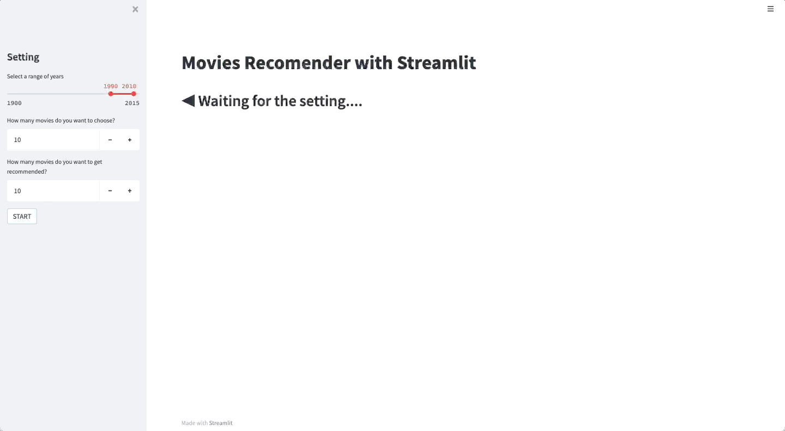

# Streamlit RecSys
## Demo
[Streamlit Cloud](https://share.streamlit.io/thejungwon/streamlit-recsys/main/main.py)
## Preview



## Prerequisite

- Python 3.8+

## Installation

```
pip install -r requirements.txt
```

## How to Run

```
streamlit run main.py
```

## Dataset Reference

- F. Maxwell Harper and Joseph A. Konstan. 2015. The MovieLens Datasets: History and Context. ACM Transactions on Interactive Intelligent Systems (TiiS) 5, 4: 19:1–19:19. https://doi.org/10.1145/2827872
